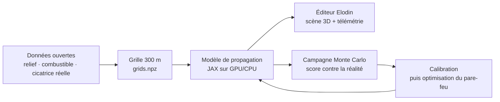

# Pipeline : de la donnée satellite à la campagne Monte Carlo

Ce document explique **la chaîne complète** de l'exemple `wildfire-aude` : d'où
viennent les données, comment on les transforme, comment on modélise le feu, et
**pourquoi** chaque choix a été fait plutôt qu'un autre. C'est le document à
lire pour comprendre — ou critiquer — la démarche. Le `README.md` voisin est le
mode d'emploi ; celui-ci est la justification.

---

## 1. L'intention

La question de départ était : *« un incendie de forêt, ça a des équations ? Si
oui, on peut le simuler et faire du Monte Carlo pour déterminer où agir de façon
optimale. »*

La réponse est oui, et la boucle complète tient en cinq maillons :



Le point crucial est le maillon E→F : **sans confrontation à un feu réel, une
simulation d'incendie ne vaut rien.** N'importe quel automate cellulaire produit
une belle tache qui grandit. Ce qui rend l'exercice honnête, c'est de comparer
la tache simulée à la cicatrice cartographiée par satellite, et de mesurer
l'écart. C'est pourquoi le pipeline commence par la *vérité terrain*, pas par le
modèle.

L'événement choisi est l'incendie du massif des Corbières (Aude), parti le
**5 août 2025 vers 16 h** en bord de la D212 entre Ribaute et Lagrasse. Poussé
par une tramontane de secteur nord-ouest avec des rafales proches de 60 km/h
dans une masse d'air à 35 °C, il a parcouru une vingtaine de kilomètres vers le
sud-est en une nuit : **~16 000 ha affectés** sur 16 communes, dont
**11 391 ha de végétation brûlée** cartographiés par satellite. Éteint le
28 août 2025. C'est le plus grand incendie français depuis des décennies, il est
bien documenté, et ses données sont publiques : le cas idéal.

---

## 2. Les données d'entrée

Quatre couches, toutes ouvertes, toutes versionnées dans `data/`.

| Couche | Source | Rôle dans le modèle | Licence |
|---|---|---|---|
| Périmètre brûlé | [EFFIS](https://forest-fire.emergency.copernicus.eu/) (Copernicus), *burnt area* n° 276934 | **Vérité terrain** : la cible du score | CC-BY |
| Relief | [Copernicus DEM GLO-30](https://registry.opendata.aws/copernicus-dem/) (ESA), 30 m | Facteur de pente $\phi_s$ + rendu 3D | Libre (ESA/Airbus) |
| Occupation du sol | [ESA WorldCover 10 m v200](https://esa-worldcover.org/) (2021) | Classes de combustible et fraction brûlable | CC-BY 4.0 |
| Météo | Prévision Météo-France du 05/08/2025, rapports presse/ECHO | Ancrage du vent, de l'humidité, de la température | Documentaire |

### Pourquoi ces sources précisément

**EFFIS** parce que c'est le seul jeu européen qui publie des *polygones de
surface brûlée* géoréférencés peu après l'événement, avec une ventilation par
classe de végétation. Cette ventilation sert de contrôle croisé indépendant :
EFFIS annonce une cicatrice dominée par des landes sclérophylles et des
conifères, et notre carte de combustible doit être cohérente avec ça (test
automatique dans `reference.py` : plus de 60 % de cellules ligneuses dans la
cicatrice).

**Copernicus DEM** plutôt qu'un DEM national (RGE ALTI de l'IGN, 1 m) parce que
30 m est déjà dix fois plus fin que la grille de calcul, l'accès est
anonyme en HTTP par tuiles, et la reproductibilité hors de France est garantie.
Le 1 m serait du gaspillage : le modèle ne consomme que la pente moyenne entre
centres de cellules distants de 300 m.

**ESA WorldCover** parce que 10 m suffit pour distinguer garrigue, forêt,
cultures et zones bâties, et que c'est mondial et daté. Un modèle de combustible
opérationnel (Anderson, Scott & Burgan, ou le catalogue Prometheus européen)
serait plus riche — mais il faudrait des inventaires forestiers locaux qui
n'existent pas en accès ouvert. Le compromis est assumé et documenté en § 6.

**La météo** n'est pas une couche raster mais quatre nombres (direction, force,
rafales, température) issus du bulletin de vigilance rouge. C'est la faiblesse
principale des données d'entrée : pas de champ de vent horaire réanalysé
(ERA5 ou AROME le fourniraient). Conséquence directe § 6.

### Ce que `data/prep_data.py` fabrique

Le script tourne **une seule fois** (il a besoin du réseau) et produit deux
fichiers versionnés, pour que l'exemple soit ensuite reproductible hors ligne :

```text
data/effis_ba_276934.json   réponse brute de l'API EFFIS, telle quelle
data/grids.npz              elevation, fuel_class, burnable_frac, truth
data/meta.json              géométrie du domaine + cellule d'allumage
```

Les transformations, dans l'ordre :

1. **Définir le domaine.** Une boîte lon/lat englobant le périmètre EFFIS avec
   de la marge, convertie en mètres via une approximation locale de la
   projection (`m_per_deg_lon` = f(latitude)). Résultat : une grille de
   **114 × 70 cellules de 300 m** (7 980 cellules de 9 ha), soit
   **34,2 × 21,0 km**, repère **ENU**, origine au coin sud-ouest, ligne 0 = sud,
   colonne 0 = ouest.
2. **Échantillonner le relief.** Lecture fenêtrée des tuiles DEM directement en
   HTTP (`rasterio` sur URL, pas de téléchargement complet), au centre de chaque
   cellule. Le domaine chevauche la frontière 43° N, donc deux tuiles sont
   assemblées.
3. **Agréger l'occupation du sol.** Chaque cellule de 300 m contient ~900 pixels
   WorldCover de 10 m. On en tire deux choses : la classe de combustible
   **majoritaire** (0 = non brûlable, 1 = herbe/culture, 2 = garrigue,
   3 = forêt) et la **fraction brûlable** (part des pixels non bâtis/non
   minéraux/non eau). Cette fraction module ensuite la vitesse de propagation et
   le stock de combustible : une cellule à 60 % de garrigue brûle plus lentement
   et moins longtemps qu'une cellule pleine.
4. **Rasteriser la vérité.** Les polygones EFFIS deviennent un masque booléen
   par test d'appartenance des centres de cellule (`matplotlib.path`). C'est ce
   masque qui sert de cible au score, et sa surface doit retomber à moins de 3 %
   de la valeur EFFIS publiée — vérifié automatiquement.
5. **Fixer l'allumage.** La cellule correspondant au départ de feu documenté
   (D212 entre Ribaute et Lagrasse) est enregistrée dans `meta.json`, avec un
   test qu'elle est bien brûlable.

`reference.py` recharge tout ça et l'expose dans le repère de la scène.
`python reference.py` rejoue les contrôles de cohérence et imprime le profil du
domaine — à lancer si vous touchez aux données :

```text
grid 114 x 70 cells of 300 m (34.2 x 21.0 km)
elevation -1..629 m
truth scar 11313 ha (EFFIS 11391 ha, official 16000 ha)
fuel cells none/grass/shrub/forest: [8, 1089, 1889, 4994]
ignition cell (17, 50)
sanity checks passed
```

Deux choses à y lire. La cicatrice rasterisée (11 313 ha) retombe à 0,7 % de la
valeur EFFIS publiée : la rasterisation ne biaise pas le score. Et le domaine
est **dominé par la forêt** (4 994 cellules sur 7 980) devant la garrigue
(1 889) — cohérent avec la ventilation EFFIS, et important pour la suite : c'est
la classe la plus lente à propager.

---

## 3. Le choix du modèle

### Le paysage des modèles d'incendie

| Famille | Principe | Coût | Exemples |
|---|---|---|---|
| Empirique / semi-empirique | Corrélations mesurées sur brûlages expérimentaux → une vitesse de propagation | ~0 | Rothermel (1972), McArthur |
| Front propagé | Le front est une courbe qui avance à la vitesse locale (Huygens ou ensemble de niveaux) | faible | FARSITE, ForeFire, Prometheus |
| Automate cellulaire | Grille, propagation de cellule à cellule | faible | FlamMap, nombreux modèles régionaux |
| Physique complète | Navier-Stokes réactif, rayonnement, pyrolyse | énorme | FIRETEC, WFDS, FireFOAM |

Le modèle d'ici est un **automate cellulaire dont la vitesse de propagation est
une décomposition de type Rothermel** — exactement les ingrédients des outils
opérationnels, dans une implémentation transparente et vectorisée.

**Pourquoi pas la physique complète ?** Un calcul FIRETEC couvre quelques
centaines de mètres pendant quelques minutes sur un supercalculateur. Ici il
faut 34 km pendant 24 h, et surtout il faut le faire **des dizaines de fois**
pour la campagne Monte Carlo. Ce n'est pas un arbitrage de commodité : c'est le
même arbitrage que font les services opérationnels, qui n'utilisent la CFD que
pour de la recherche sur des cas d'école.

**Pourquoi pas un ensemble de niveaux (level-set) comme ForeFire ?** C'est plus
élégant (pas de biais de discrétisation directionnelle) mais nettement plus
lourd à écrire correctement, et le gain est invisible à 300 m de résolution.
L'automate garde un avantage décisif ici : le pas de temps se réduit à
**8 décalages de tableau + une somme pondérée**, donc entièrement vectorisable
en JAX, donc rapide et différentiable.

### Les équations

La vitesse de propagation d'une cellule en feu vers sa voisine dans la
direction $d$ :

$$R_d = R_0 \cdot \eta_M \cdot \phi_w(d) \cdot \phi_s(d)$$

C'est la structure multiplicative de Rothermel : une vitesse de référence
corrigée par des facteurs sans dimension.

**$R_0$ — vitesse de base, sans vent, combustible sec.** Par classe :
herbe 0,055 m/s, garrigue 0,050, forêt 0,022 (ordres de grandeur usuels des
brûlages expérimentaux méditerranéens). Multipliée par la fraction brûlable de
la cellule et par le facteur de calibration `r0_scale`. La forêt propage plus
lentement que la garrigue en surface — contre-intuitif mais bien documenté : le
couvert réduit le vent au sol et les combustibles fins y sont moins continus.

**$\eta_M$ — amortissement par l'humidité**, polynôme de Rothermel (1972) :

$$\eta_M = 1 - 2{,}59\,r + 5{,}11\,r^2 - 3{,}52\,r^3, \qquad r = \frac{M}{M_x}$$

avec $M$ l'humidité des combustibles fins morts et $M_x = 0{,}25$ l'humidité
d'extinction. À $M = 0{,}08$ (canicule) on obtient $\eta_M \approx 0{,}37$ ; à
$M = 0{,}20$ il tombe à $\approx 0{,}05$ : le feu ne se propage plus. Cette
non-linéarité brutale est physique, et elle explique la sensibilité décrite
en § 6.

**$\phi_w$ — facteur de vent**, exponentiel dans la composante du vent alignée
avec la direction de propagation :

$$\phi_w = \exp\!\big(k_w \max(0, \vec W \cdot \hat u_d)\big) \cdot \exp\!\big(-0{,}06 \max(0, -\vec W \cdot \hat u_d)\big)$$

Le premier terme accélère le feu de tête, le second freine (faiblement) le feu
de dos. Avec $k_w = 0{,}22$ et 52 km/h, le rapport tête/flanc atteint ~25 :
c'est l'ordre de grandeur observé sur les feux de garrigue poussés par le vent,
et c'est ce qui donne à la cicatrice sa forme d'ellipse très allongée.

**$\phi_s$ — facteur de pente**, exponentiel dans la tangente de la pente
locale calculée sur le vrai DEM :

$$\phi_s = \exp(k_s \tan\theta_d)$$

La montée accélère le feu (les flammes préchauffent le combustible au-dessus).
La règle du pouce de van Wagner — doublement tous les ~10° — correspond à
$k_s \approx 4$ ; la valeur par défaut est 3,0, dans la plage dispersée par la
campagne.

### La discrétisation : pourquoi le front avance exactement à $R$

Chaque cellule accumule une **progression d'allumage** $p$ alimentée par ses
8 voisines :

$$\frac{dp}{dt} = \sum_{d} I_d \, \frac{R_d}{\Delta_d}, \qquad p \ge 1 \Rightarrow \text{allumage}$$

où $I_d$ est l'intensité de la voisine (0 à 1) et $\Delta_d$ la distance entre
centres (300 m en droit, 424 m en diagonale). L'astuce est là : une cellule
alimentée par une seule voisine à pleine intensité s'allume au bout de
$\Delta / R$ secondes, c'est-à-dire **exactement** le temps qu'il faut au front
pour parcourir la distance à la vitesse $R$. La propagation est donc consistante
avec la vitesse de Rothermel *par construction*, sans facteur d'ajustement
caché — ce que beaucoup d'automates cellulaires ratent.

Tout ce qui est statique (masques de bord, facteur de pente, $R_0$ de la source,
$1/\Delta$) est **précalculé en 8 noyaux** au moment de la construction du
monde. Un pas de temps se réduit alors à 8 `jnp.roll` et une somme
multiply-accumulate : c'est ce qui permet 4 320 pas en ~10 s sur un portable.

### Combustion et extinction

Une cellule allumée fait monter son intensité vers une cible limitée par le
combustible restant, avec une constante de temps de 2 minutes, et consomme son
combustible selon un temps de résidence par classe (herbe 10 min, garrigue
30 min, forêt 60 min). L'intensité s'éteint quand le combustible est épuisé —
c'est ce qui crée un **front** (un anneau actif) plutôt qu'une tache
uniformément en feu, et c'est ce qui alimente la couche « calciné » du rendu.

### Les sautes de feu (spotting)

Un sous-ensemble aléatoire de cellules est tiré comme « source de braises » :
quand elles brûlent intensément, elles injectent de la chaleur **une distance de
saute en aval du vent** (0,9 km par défaut). C'est le mécanisme qui, dans la
réalité, fait franchir les coupures et prend les équipes de vitesse. Il est ici
volontairement simple (décalage statique le long du vent moyen) mais il change
qualitativement le comportement : sans lui, un pare-feu est toujours efficace,
ce qui serait un mensonge dangereux pour l'exercice d'optimisation.

### Le vent

Pas de champ météo réanalysé, donc un profil synthétique construit sur les
valeurs documentées :

- direction et force moyennes (tramontane, 297°, 52 km/h par défaut) ;
- **cycle diurne** : maximum à l'heure d'allumage, minimum avant l'aube ;
- **serpentement lent** de la direction, période 6 h, amplitude 12° ;
- **rafales** synthétisées comme une somme déterministe de six sinusoïdes de
  périodes 5 à 60 min, normalisée à variance unité.

Le point important : **tout l'aléa est dérivé de la graine `noise_seed`**. Deux
exécutions avec la même graine sont identiques au bit près, et la campagne
disperse la graine. C'est indispensable pour qu'un résultat Monte Carlo soit
rejouable et débogable.

---

## 4. L'exécution dans Elodin

Le modèle est un unique système ECS `@el.map` sur une seule entité nommée
`fire`, dont les composants sont des **tableaux plats de 7 980 cellules** :

| Composant | Taille | Rôle |
|---|---|---|
| `fire.fuel`, `fire.progress`, `fire.intensity` | 7 980 | l'état réel du modèle |
| `fire.viz_flame`, `fire.viz_char` | 874 | grilles sous-échantillonnées (38 × 23 blocs) pour la scène 3D |
| `fire.burned_ha`, `fire.truth_ha`, `fire.truth_iou`, `fire.active_ha`, `fire.wind_kmh` | 1 | métriques tracées |
| `fire.wind_ms` | 3 | vecteur vent pour la flèche 3D |

Choix d'implémentation qui méritent l'explication :

- **Une entité, pas 7 980 entités.** L'ECS d'Elodin est conçu pour des
  véhicules, pas pour des grilles. Mettre chaque cellule dans une entité
  coûterait cher pour rien : le modèle est intrinsèquement un calcul de tableau.
  Le prix à payer est que la visualisation doit indexer les composants
  (`fire.viz_flame[i]`) — d'où le point suivant.
- **Deux grilles de visualisation séparées.** Le calcul tourne à 300 m, mais la
  scène agrège par blocs (3 cellules = 900 m pour le feu, 2 cellules = 600 m
  pour le terrain). Sans ça, la scène demanderait ~8 000 objets 3D animés :
  l'éditeur s'écroule. Le sous-échantillonnage se fait **dans le tick JAX**
  (max pour les flammes, moyenne pour le calciné), donc gratuitement.
- **Débits découplés.** `simulation_rate=60 Hz` ne règle que l'horloge de
  lecture (60 pas/s × 20 s = 1 200× le temps réel) ; `telemetry_rate=6 Hz`
  n'enregistre qu'un pas sur dix dans la base. Sans ce découplage, 4 320 pas ×
  8 000 valeurs saturent la base et l'éditeur.
- **`backend="jax-cpu"` forcé.** Le backend Cranelift déclenche une assertion de
  portée de saut sur ARM64 avec une fonction de tick aussi grosse. XLA la digère
  sans problème. C'est un contournement, documenté comme tel dans `main.py`.

---

## 5. Le rendu : ce qui est physique, ce qui est stylisé

C'est la section à ne pas sauter, parce qu'une belle image donne une impression
de rigueur qu'elle ne mérite pas toujours.

**Physique (issu directement des données ou du calcul) :**

- le relief des blocs de terrain (DEM, avec une exagération verticale ×2 assumée
  pour la lisibilité) ;
- l'ombrage de relief, calculé en éclairement lambertien du DEM, soleil au
  nord-ouest à 45° ;
- la couleur des blocs (classe WorldCover) ;
- la position et la taille du front (`fire.intensity`), la zone calcinée
  (combustible consommé) ;
- le pointillé rouge du périmètre EFFIS (polygone brut, 1 point sur 6) ;
- la flèche de vent (`fire.wind_ms`, valeur instantanée du modèle) ;
- le point d'allumage (position documentée).

**Stylisé (choix de rendu, aucune valeur physique) :**

- l'**échelle du lit de braises**. Les flammes elles-mêmes sont désormais
  authentifiées à leur longueur réelle (45-65 m, cohérent avec un feu de
  garrigue), mais à 13 km de distance elles ne font que quelques pixels : c'est
  la plaque incandescente au sol, aidée du bloom HDR, qui porte la ligne de feu.
  Sa taille est un choix de signalétique, pas une mesure.
- la **dynamique des particules**. La lecture se fait à 1 200× le temps réel :
  une fumée qui monterait à sa vitesse réelle (~10 m/s, soit 12 km/s à
  l'écran) serait un flou illisible. Le panache est donc une structure
  quasi-statique stylisée, penchée dans la direction du vent simulé.
- l'exagération verticale ×2 du relief, les couleurs saturées, le bloom HDR.

En clair : **les positions, surfaces et temps sont quantitatifs ; les flammes
sont une signalétique.** Les graphes à droite de l'éditeur sont la vraie mesure.

---

## 6. Monte Carlo : calibrer, puis optimiser

### Pourquoi c'est le cœur et pas un supplément

Un run unique de simulation d'incendie ne prouve rien : trop de paramètres sont
mal connus (humidité réelle du combustible, force exacte du vent au sol,
position précise de l'allumage). La seule affirmation défendable est
**statistique** : « sur la distribution des conditions plausibles, voilà la
distribution des surfaces brûlées ». C'est le mode de raisonnement de FSim aux
États-Unis pour la cartographie du risque, et c'est ce que la campagne
reproduit.

`spec.toml` disperse exactement ce qui est incertain : vent
(force/direction/rafales), humidité, les boutons du modèle ($R_0$, $k_w$,
saute), la position d'allumage, et la graine du bruit. Chaque run se note
lui-même dans `main.py` en émettant :

- `truth_iou` — intersection sur union entre tache simulée et cicatrice EFFIS ;
- `burned_ha` et `area_error_frac` ;
- `active_ha_end`.

`hooks/score.py` en fait un verdict par run, `hooks/report.py` agrège la
campagne et sort **les meilleurs jeux de paramètres** — le signal de
calibration. Une campagne de 48 runs prend ~1 min et a donné :

```text
runs completed: 48   passed: 5/48
IoU vs cicatrice EFFIS   moyenne 0,216   médiane 0,271   meilleur 0,512
surface brûlée (ha)      médiane 18 950  p95 35 453      vérité 11 391
meilleur ajustement : vent 301° à 45 km/h, r0_scale 1,04, k_wind 0,218, humidité 0,075
```

**Ce « 5 sur 48 » mérite une explication, et elle est instructive.** Les 48 runs
s'exécutent tous correctement ; « passed » est le verdict de `hooks/score.py`,
qui exige à la fois un IoU ≥ 0,25 et une erreur de surface ≤ 60 %. Or la médiane
d'IoU est de 0,271, donc **plus de la moitié des runs passent le critère de
recouvrement** : les échecs viennent presque tous du critère de surface. Le run
médian brûle 18 950 ha contre 11 391 ha réels, soit 66 % d'erreur — juste
au-dessus du seuil.

Autrement dit, le modèle **sur-brûle systématiquement** sous la dispersion
retenue, et il le fait pour une raison identifiée : il simule un feu libre,
sans aucun moyen de lutte, alors que la cicatrice EFFIS est le résultat d'un feu
massivement combattu (§ 8). Le seuil de 60 % n'est pas trop sévère ; c'est le
modèle qui est optimiste, et le calage l'absorbe en rabaissant `r0_scale`.

Les valeurs par défaut de `sim.py` sont un point calibré à la main plus robuste :
IoU **0,383 en moyenne sur cinq graines** (0,347-0,412) pour **15 000-17 500 ha**
de surface brûlée, à comparer aux 11 391 ha cartographiés par EFFIS et aux
16 000 ha officiellement affectés. Le modèle brûle donc un peu trop, ce qui est
attendu puisqu'il ignore la lutte contre le feu (§ 8).

Attention en lisant les graphes de l'éditeur : les bornes d'axe affichées ne
sont pas les maxima des données. Sur ce run, l'axe « Surface brûlée » annonce
53 348 ha alors que la série culmine à 17 460 ha — un facteur 3 sur une
grandeur pourtant monotone croissante. Les chiffres qui font foi sont ceux du
rapport de campagne, pas ceux lus sur un axe.

### Deux leçons désagréables mais importantes

**Sensibilité de percolation.** La surface brûlée totale est extrêmement raide
en $R_0 \cdot \eta_M$ : 25 % de vitesse de base en moins fait passer le feu de
15 000 ha à 3 000 ha. Ce n'est pas un défaut d'implémentation — c'est le seuil
de percolation, et les vrais modèles le partagent. Conséquence pratique : le
livrable est une distribution, jamais un run.

**Sensibilité à la graine.** Un run isolé ne caractérise même pas son propre jeu
de paramètres, parce que la réalisation des rafales compte. Mesuré directement,
en rejouant les paramètres par défaut avec cinq graines de bruit différentes et
rien d'autre qui change :

| `noise_seed` | surface brûlée | IoU |
|---|---|---|
| 1 | 15 381 ha | 0,384 |
| 2 | 15 030 ha | 0,400 |
| 3 | 17 154 ha | 0,372 |
| 4 | 17 460 ha | 0,347 |
| 5 | 17 226 ha | 0,412 |

Soit **15 000-17 500 ha et un IoU de 0,35-0,41 pour des paramètres physiques
strictement identiques** : ±8 % sur la surface, ±9 % sur le score. La
conséquence pratique est qu'un écart d'IoU inférieur à ~0,05 entre deux jeux de
paramètres n'est pas un signal, c'est du bruit — et qu'il faut calibrer sur la
moyenne à travers les graines, jamais sur un tirage chanceux. C'est le piège du
surapprentissage, version physique.

Reproduire la mesure (plan à cinq lignes, seule `noise_seed` variant) :

```bash
elodin monte-carlo run examples/wildfire-aude/main.py \
  --plan plan_graines.csv --campaign examples/wildfire-aude/campaign.toml \
  --out /tmp/wf_baseline --workers 3
```

### Puis : où agir

Les paramètres `firebreak_*` creusent une bande sans combustible (un pare-feu
tactique) avant l'allumage. En dispersant sa position **tout en dispersant la
météo**, on obtient pour chaque emplacement une distribution de surface brûlée,
et on choisit l'emplacement qui minimise l'espérance — et surtout le **p95**,
parce qu'en gestion de crise c'est la queue de distribution qui compte, pas la
moyenne. Le mode opératoire est dans le `README.md`.

---

## 7. Récapitulatif des décisions

| Décision | Alternative écartée | Raison |
|---|---|---|
| Automate cellulaire + Rothermel | CFD réactive (FIRETEC) | 24 h × 34 km × 48 runs impossible en CFD |
| Automate cellulaire | Level-set (ForeFire) | Gain invisible à 300 m, coût d'écriture élevé, vectorisation moins directe |
| Grille 300 m | 30 m (résolution du DEM) | ×100 de cellules pour un front dont l'incertitude physique dépasse déjà 300 m |
| Pas de 20 s | Pas adaptatif | À 0,3 m/s max, 20 s = 6 m ≪ cellule : stable et simple |
| WorldCover → 4 classes | Modèles de combustible Anderson/Prometheus | Les inventaires locaux nécessaires ne sont pas ouverts |
| Vent synthétique | Réanalyse ERA5/AROME | Pas d'accès ouvert simple à l'échelle horaire ; limite assumée (§ 8) |
| Une entité, composants tableaux | Une entité par cellule | L'ECS n'est pas fait pour 8 000 entités de grille |
| Grilles de viz sous-échantillonnées | Rendu par cellule | L'éditeur ne tient pas 8 000 objets animés |
| Terrain en blocs 3D | Maillage `world_mesh` | `world_mesh` exige un domaine carré en mètres, un préprocess GPU et ~512 Mo d'atlas non versionnables |
| Particules bevy_hanabi | Sprites/billboards ad hoc | Format `.effect` partagé avec pyrotechnique : authoring visuel et portage direct |

---

## 8. Limites connues

À dire avant qu'on nous les reproche :

1. **Pas de basculement synoptique du vent.** La cicatrice réelle a un lobe nord
   (vers Lagrasse) que la simulation ne reproduit jamais. Il a probablement
   brûlé avant que la tramontane s'établisse pleinement. Ajouter une rampe de
   direction sur les premières heures est la première amélioration à faire.
2. **Pas de lutte contre le feu.** Aucun largage, aucune attaque au sol. Les
   ~16 000 ha réels sont un résultat *avec* des moyens considérables engagés ;
   le modèle décrit donc un feu libre, et le calage absorbe la différence dans
   `r0_scale`. C'est méthodologiquement inconfortable.
3. **Humidité uniforme.** Pas de variation avec l'exposition, l'altitude ou
   l'heure, alors que les versants nord sont nettement plus humides.
4. **Sautes de feu rudimentaires.** Distance fixe le long du vent moyen, pas de
   distribution de distance ni de dépendance à l'intensité du panache.
5. **Modèle de combustible grossier.** Quatre classes, pas de charge de
   combustible ni de rapport surface/volume, alors que ce sont les entrées
   canoniques de Rothermel.
6. **Aucune validation croisée.** Un seul événement. Un vrai calage demanderait
   plusieurs feux, dont certains gardés en test.

Autrement dit : c'est un **démonstrateur de méthode** — vraies données, modèle
défendable, campagne notée contre la réalité — pas un outil opérationnel.
ForeFire (CNRS / Université de Corse) et FARSITE portent vingt ans de calage de
modèles de combustible ; c'est vers eux qu'il faut aller pour du réel. Ce que
cet exemple montre, c'est la boucle complète : **données ouvertes → physique sur
grille → visualisation → calibration Monte Carlo → optimisation de
l'intervention.**
